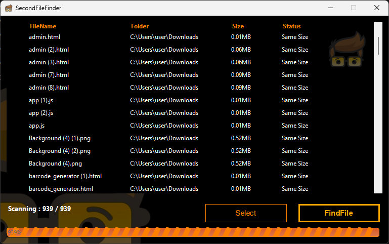

# SecondFileFinder

A fast and reliable **Windows desktop application** built with **C# and .NET** for finding and managing duplicate files.

The application uses a two-step detection process: files are first grouped by **file size**, then their contents are compared using **SHA-256 hashing**. This reduces unnecessary file comparisons and helps identify exact duplicate files efficiently.



---

## ✨ Features

* 🔍 **Duplicate File Detection**

  * Detects files with identical content.
  * Uses SHA-256 hashing for reliable comparison.

* ⚡ **Fast Scanning**

  * Groups files by file size before calculating hashes.
  * Avoids hashing files that cannot possibly be duplicates.

* 🔐 **SHA-256 Hash Verification**

  * Generates SHA-256 hashes for candidate files.
  * Files with matching hashes are identified as duplicates.

* 📁 **Folder Selection**

  * Select folders/drives to scan.
  * Scan large collections of files from a selected location.

* 📊 **Results Table**

  * Displays detected files in a DataGridView.
  * Makes it easier to review duplicate groups and file information.

* 📈 **Scan Progress**

  * Shows the current scanning progress.
  * Helps users understand how much of the scan has completed.

* ⛔ **Cancel Scan**

  * Allows users to stop a running scan.
  * Prevents unnecessary processing when the scan is no longer required.

* 🛡️ **Access Denied Handling**

  * Handles files that cannot be accessed because of Windows permissions.
  * Prevents inaccessible files from stopping the entire scan.

* 🗑️ **Duplicate File Management**

  * Helps users identify unnecessary duplicate files.
  * Makes it easier to decide which copies can be removed.

---

## 🧠 How It Works

The application uses a multi-stage process to improve scanning performance.

```text
                Start Scan
                    │
                    ▼
            Select Folder / Drive
                    │
                    ▼
              Find All Files
                    │
                    ▼
            Group Files by Size
                    │
                    ▼
       ┌────────────┴────────────┐
       │                         │
 Unique Size                Same Size
       │                         │
       ▼                         ▼
     Skip                 Calculate SHA-256
                                 │
                                 ▼
                        Compare Hashes
                                 │
                    ┌────────────┴────────────┐
                    │                         │
              Different Hash             Same Hash
                    │                         │
                    ▼                         ▼
              Not Duplicate              Duplicate
```

### Why File Size First?

Calculating a cryptographic hash for every file can take considerable time, especially when scanning large drives.

Instead, the application first groups files by their size.

For example:

```text
File A → 10 MB
File B → 10 MB
File C → 25 MB
File D → 50 MB
```

Only files with the same size need further comparison.

```text
10 MB
 ├── File A
 └── File B
     ↓
   SHA-256
     ↓
 Compare Hash
```

This reduces unnecessary hash calculations.

---

## 🔐 Duplicate Detection Algorithm

The application follows these basic steps:

### 1. Scan Files

The selected directory is recursively scanned to find available files.

### 2. Get File Size

Each file's size is obtained.

### 3. Group by Size

Files are grouped according to their file size.

```text
Size
│
├── 1 KB
├── 10 KB
│    ├── File A
│    └── File B
├── 50 KB
└── 100 MB
```

Files with unique sizes cannot be exact duplicates.

### 4. Calculate SHA-256

For files sharing the same size, the application calculates a SHA-256 hash.

Example:

```text
File A
SHA-256:
A7F5F35426B927411FC9231B56382173...
```

```text
File B
SHA-256:
A7F5F35426B927411FC9231B56382173...
```

If both files have the same hash and size, they are considered duplicates.

### 5. Display Results

Detected duplicate files are displayed in the application's results interface.

---

## 🛠️ Technologies Used

| Technology                    | Purpose                     |
| ----------------------------- | --------------------------- |
| C#                            | Application development     |
| .NET                          | Application framework       |
| Windows Forms                 | Desktop user interface      |
| SHA-256                       | File content verification   |
| DataGridView                  | Display scan results        |
| File System APIs              | File and directory scanning |
| Async / Background Processing | Responsive scanning         |
| Visual Studio                 | Development environment     |

---

## 📂 Project Structure

A typical project structure may look like:

```text
DuplicateFileFinder/
│
├── Properties/
│
├── Forms/
│   ├── MainForm.cs
│   └── MainForm.Designer.cs
│
├── Services/
│   └── DuplicateScanner.cs
│
├── Models/
│   └── FileInfoModel.cs
│
├── Resources/
│
├── Program.cs
│
├── DuplicateFileFinder.csproj
│
└── README.md
```

> The exact structure may differ depending on the project version.

---

## 🚀 Getting Started

### Prerequisites

Before running the project, make sure you have:

* Windows 10 or later
* Visual Studio
* .NET SDK / Runtime compatible with the project
* Basic permissions to access the folders you want to scan

### Clone the Repository

```bash
git clone https://github.com/your-username/DuplicateFileFinder.git
```

Navigate to the project:

```bash
cd DuplicateFileFinder
```

### Open the Project

Open the project in **Visual Studio**.

Then:

1. Restore NuGet packages if required.
2. Select the appropriate build configuration.
3. Build the solution.
4. Run the application.

---

## ▶️ How to Use

### Step 1 — Select a Folder

Choose the folder or drive you want to scan.

### Step 2 — Start the Scan

Click the **Scan** button.

The application will:

```text
Find Files
   ↓
Group by Size
   ↓
Calculate SHA-256
   ↓
Compare Hashes
   ↓
Find Duplicates
   ↓
Display Results
```

### Step 3 — Review Results

Review the duplicate files displayed in the results table.

### Step 4 — Manage Duplicates

Select unnecessary duplicate files and manage them according to your requirements.

### Step 5 — Cancel if Necessary

If the scan is taking too long, use the **Cancel** option to stop the operation.

---

## 📊 Example

Suppose a folder contains:

```text
Documents/
│
├── report.pdf
├── report-copy.pdf
├── image.jpg
├── photo.jpg
└── backup.zip
```

If `report.pdf` and `report-copy.pdf` contain exactly the same data:

```text
report.pdf
SHA-256: ABC123...

report-copy.pdf
SHA-256: ABC123...
```

The application identifies them as duplicates.

---

## ⚡ Performance Optimization

The application does not immediately hash every file.

Instead:

```text
All Files
   │
   ▼
Compare File Sizes
   │
   ├── Unique Size → Ignore
   │
   └── Same Size
          │
          ▼
      SHA-256 Hash
          │
          ▼
      Compare Hash
```

This approach can significantly reduce unnecessary file processing when scanning large directories.

---

## 🛡️ Error Handling

The application is designed to continue scanning even when certain files cannot be accessed.

Common situations include:

* Access denied
* File currently in use
* Protected Windows files
* Permission restrictions
* Invalid or unavailable paths

Instead of terminating the entire scan, inaccessible files can be skipped and the scanning process can continue.

---

## 🔒 SHA-256

SHA-256 is a cryptographic hash function that produces a fixed-length **256-bit hash**.

Example:

```text
File Content
     │
     ▼
 SHA-256
     │
     ▼
256-bit Hash
```

Two files with identical content should produce the same SHA-256 hash.

> Hash matching is used together with file size comparison to identify exact duplicate candidates.

---

## ⚠️ Safety Notice

Deleting duplicate files is potentially destructive.

Before removing files:

* Verify the file paths.
* Keep at least one required copy.
* Be careful with system and application files.
* Consider creating a backup before large-scale cleanup.

**Do not automatically delete files unless you are certain they are safe to remove.**

---

## 🎯 Use Cases

Duplicate File Finder can be useful for:

* 🖥️ Cleaning personal computers
* 💾 Freeing disk space
* 📁 Organizing large folders
* 📸 Finding duplicate photos
* 🎬 Finding duplicate videos
* 📚 Cleaning duplicate documents
* 💿 Managing backup folders
* 🗄️ Maintaining large storage drives

---

## 🔮 Future Improvements

Possible future features include:

* [ ] Duplicate file preview
* [ ] Image preview
* [ ] File type filtering
* [ ] Search by extension
* [ ] Sort by file size
* [ ] Sort by duplicate group
* [ ] One-click duplicate selection
* [ ] Move duplicates to Recycle Bin
* [ ] Export scan results
* [ ] CSV / JSON report generation
* [ ] Dark / Light theme
* [ ] Scan history
* [ ] Advanced filtering
* [ ] Exclude selected folders
* [ ] Multi-drive scanning

---

## 👨‍💻 Author

**Kalhara Nonis**

GitHub: `@kalharanonis0`

---

## 📌 Project Summary

**Duplicate File Finder** is a Windows desktop utility designed to efficiently identify exact duplicate files.

Its detection process combines:

```text
File Size
    +
SHA-256 Hash
    ↓
Duplicate Detection
```

The project demonstrates practical use of **C#**, **.NET**, **Windows Forms**, **file system programming**, **cryptographic hashing**, **asynchronous processing**, and **error handling**.

---


